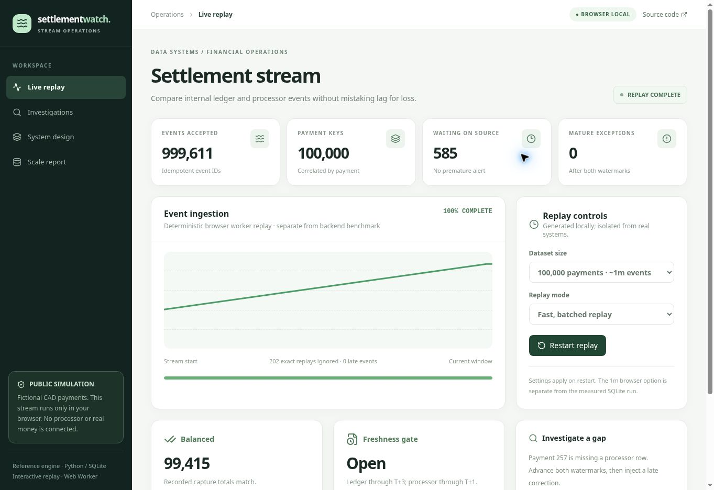

# Settlement Watch

**Event-time reconciliation for high-volume payment operations.** A marketplace's internal ledger and payment processor may disagree about captures and refunds. Settlement Watch correlates both streams by tenant and payment, waits for source completeness before raising a mismatch, and lets a late record correct an exception without hiding the revision.

**[Open the live interactive replay](https://settlement-watch.netlify.app/)** · [Browser setup](web/README.md) · [Architecture and limits](docs/architecture.md) · [Measured local benchmark](docs/benchmark.md)



This is a runnable reference system with **synthetic data**, not a payment product or customer deployment. It never initiates transfers, refunds, or payouts.

## The operating scenario

A customer-facing team sees a CAD 25.00 capture in its ledger but no processor capture. The absence may mean the processor export is still behind. When **both** source watermarks pass the event-time grace window, a difference becomes an exception. A late processor event can later balance the payment and is marked late. A conflicting duplicate ID is rejected instead of doubling the money.

The live browser replay uses fictional payments; the independently runnable Python + SQLite engine implements the durable contract. **There is no live customer connector, distributed broker, shared backend on the hosted site, or real AI call in the browser.**

## Run the engine

Python 3.12+; no third-party runtime packages.

```bash
python3 -m unittest discover -s tests -q
python3 -m settlement_watch.benchmark --payments 100000
```

```python
from settlement_watch.engine import Engine
engine = Engine('operations.db', grace_seconds=120)
engine.ingest({'tenant_id': 'shop-a', 'payment_id': 'pay-1', 'event_id': 'l-1',
               'source': 'ledger', 'kind': 'capture', 'amount_minor': 2500,
               'currency': 'CAD', 'occurred_at': '2026-09-23T12:00:00Z'})
engine.advance_watermark('shop-a', 'ledger', '2026-09-23T12:05:00Z')
engine.advance_watermark('shop-a', 'processor', '2026-09-23T12:05:00Z')
print(engine.payment('shop-a', 'pay-1')['status'])  # EXCEPTION
```

`ingest_many` is atomic: one conflicting record rolls back the entire batch. A matching event ID replays without changing totals. All monetary values are integer minor units, never floats. Timestamp inputs need explicit timezones.

## AI triage boundary

`settlement_watch.triage.model_brief` is **opt-in** with `OPENAI_API_KEY` and a mature exception. It sends a bounded payment summary, watermarks, discrepancies, and up to 100 selected event records for a structured internal brief. It bypasses the model while waiting on a source or if evidence is truncated. Code validates schema and citation IDs, but cannot certify the prose. A reviewer must check every claim. The default `offline_brief` works without a network call. No real-ticket model evaluation is claimed.

## Web replay

```bash
cd web
npm ci
npm run build
npm run dev
```

The browser worker generates a deterministic stream locally. Its million-event option is a **client replay**, separate from the measured SQLite benchmark. Use it to inspect ingestion progress, anomalies, a missing processor event, watermark maturation, and a late correction. Reset clears the browser worker's state. No payment data leaves the page.
